面向多机器人路径规划的空间关系增强多头注意力通信方法
摘要：本文针对多机器人路径规划（Multi-Robot Path Planning,MRPP）中通信效率低与协作优化不足的问题，提出了一种基于图注意力机制的高效通信方法RMHA（Relation-enhanced Multi-head Attention）。该方法通过引入空间关系增强的多头注意力结构，将机器人间的相对距离信息与通信内容有机结合，实现了通信权重的动态分配与优化，从而有效降低了通信负载并提升了系统整体规划性能。实验结果表明，RMHA在不同障碍物密度环境下均表现出较强的适应性和鲁棒性，尤其在高密度复杂场景中，其路径规划成功率显著优于传统方法。进一步的消融实验验证了距离信息在通信建模与路径决策中的关键作用，表明该机制能够促进机器人间的高效协作与信息共享。综上所述，RMHA在多机器人系统的协同路径规划中具有较高的实用价值与推广潜力，为复杂环境下的智能体通信与协作提供了新的解决思路。
关键词：多机器人路径规划；图注意力机制；多头注意力；通信优化；协同决策
1 引言
多机器人路径规划（Multi-Robot Path Planning，MRPP）是人工智能和机器人领域的核心问题，其目标是在已知环境中为多个机器人设计无碰撞的路径，使它们能够从各自的起始位置顺利到达目标位置[1]。在本文的语境中，智能体和机器人这两个术语可以互换使用，没有显著的区别。在标准的MRPP问题表述中，通常包含一个图结构，该图用于表示机器人的工作空间，以及一组起始点和目标点的顶点集合。在每一个时间步长内，机器人可以做出决策，要么选择停留在当前位置，要么移动到相邻的顶点处[2]。MRPP问题的解决方案是一组路径，每条路径对应一个机器人，且这些路径在空间和时间上均无碰撞，具体而言，任意两个机器人不能同时占据同一个顶点或边，这是一个NP-hard问题。
一个MRPP实例由一个图、一组机器人以及它们各自的起点与终点对构成。MRPP问题可被定义为一种规划挑战，其目标是为给定的MRPP实例寻找一组无碰撞路径，这些路径集合即为所谓的解决方案。MRPP算法或求解器则指代用于解决MRPP问题的方法或技术。此外，MRPP挑战不仅涵盖MRPP问题本身，还涉及与之相关的问题，例如环境的表示方法以及在附加约束条件下解决方案的实施过程。
多机器人路径规划问题在多个行业展现了广泛的应用前景，包括智能仓储系统、城市交通网络、自动驾驶车辆以及电子游戏等领域。近年来，行业内的前沿企业对多机器人路径规划应用表现出了显著的兴趣。作为构建物理多机器人系统的一项基础任务，MRPP在设计阶段占据着至关重要的位置。随着众多领域内对于合作与竞争环境需求的持续攀升，MRPP的应用价值预计将持续扩大。实际上，在涉及多机器人系统的初期部署时，解决MRPP问题往往是首要步骤之一。例如，Zhang等人在仓储自动化场景中[3]，通过有效管理自动导引车的路线；Dresner和Stone在自动驾驶车辆交通调度方面[4]，优化道路资源利用效率；以及Ma等人在多机器人协同探索任务中[5]，确保各机器人之间的无缝协作等方面，MRPP均展现了其不可替代的重要性。
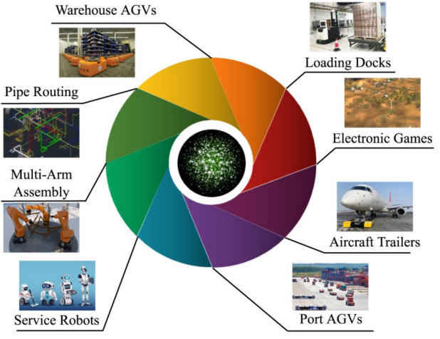

图1 MRPP问题应用场景
特别是在仓储物流运输领域，随着电子商务的迅速扩展，智慧物流系统已经成为现代供应链管理不可或缺的一部分。在此背景下，无人仓储作为提升运营效率和减少成本的重要工具，获得了越来越多的关注。自主移动机器人（Autonomous Mobile Robots，AMR）[6]作为一种新兴的机器人技术，正逐渐成为行业内的主流应用。全球AMR市场呈现出迅猛的增长势头，据市场研究机构预测，到2026年，这一市场规模预计将攀升至170亿美元。在基于AMR的无人仓储体系中，这些具备货物搬运能力的机器人能够根据订单需求，从指定货架上提取相应数量和类型的货物，并将其运送至分拣工作站，再由人工或自动化流水线接手后续处理线。相较于传统的仓储模式，无人仓储显著降低了人力成本，同时打破了分拣系统的效率瓶颈，实现了从“人找货”到“货到人”的转变。对于当前的智能无人仓而言，AMR的路径规划是整个调度流程中的核心环节。然而，随着搬运机器人数量的增加和任务复杂性的提升，如何高效且安全地规划这些机器人的移动路径，确保它们能顺利完成各自任务，成为了亟需解决的关键挑战。
集中式规划算法是多机器人路径规划（Multi-Robot Path Planning，MRPP）中最经典且常用的方法之一。此类方法依赖中央控制器或全局规划器，掌握所有机器人及其环境的完整全局信息，并据此计算（近）最优路径，通常可确保解的最优性或次优性并适用于所有可解问题。
A*是经典启发式搜索算法，最初用于单机器人路径规划。其评估函数为f(n)=g(n)+h(n)，其中g(n)为从起点到当前节点的实际代价，h(n)为对剩余距离的启发估计。当h(n)满足可接受性（不高估实际成本）时，A*能保证找到最短路径。将A*扩展到多机器人环境并非简单复用：多机器人同步行动会产生冲突，需要冲突处理与时空协调。典型扩展包括LRA*在检测到潜在冲突时对受影响机器人的轨迹做即时调整，降低预计算开销；CA*引入三维预约表（时间—空间占用表）以避免直接冲突并提升整体效率[7]；HCA*通过对原搜索空间做层级抽象以提高大规模场景中的搜索速度[7]。不足在于高密度场景中频繁重规划导致计算开销攀升；复杂环境下的效率与可扩展性仍受限；环境建模误差可能引发失效或次优解，动态复杂场景的难题尚未完全解决。
基于冲突的搜索（Conflict-Based Search，CBS）通过在单机器人最优路径搜索中逐步引入约束来实现多机器人无碰撞协同。其采用两级搜索：高级搜索负责发现并分解冲突，低级搜索在给定约束下为单个机器人求最优路径[8]。实现上构建约束二叉树：树节点包含约束集合、各机器人的最优路径（在各自约束下）及总成本；若检测到冲突，则对涉及冲突的机器人生成两个分支节点，分别施加互斥约束，再用如A*的低级搜索在新约束下求解，直至获得无冲突解，并取成本最低者为最终解[8]。
操作分解M*（Operator Decomposition based on Robot-Meta-agent Constraint-Based Search M*，ODrM*）结合解耦与耦合的优势：先令各机器人独立沿各自最优路径前进（解耦）[9]；一旦发生碰撞，仅对涉撞机器人进行耦合搜索[9]。这样避免了在多数时刻搜索全体联合空间；但在碰撞频繁场景中会触发频繁重规划，效率下降[10]。本文将ODrM*作为基准算法，其可设为有界次优规划器，允许以牺牲部分路径质量换取更短执行时间，在解质量与计算时间之间做权衡。但当智能体数量较多或环境复杂时，计算复杂度陡增、规划时间过长，因此适合作为与基于强化学习方法比较的参考[10]。
集中式方法需整合全体机器人状态做全局计算，在完全可观测条件下虽能生成高效、安全的路径，但随着机器人数量与环境规模扩大，计算复杂度呈指数增长，难以满足实时性；动态场景中的状态变化与突发故障也要求系统具备实时重规划能力，这对集中式方法构成挑战。此外，集中式方案依赖全局通信，易受延迟与带宽瓶颈影响。针对上述问题，去中心化提供有效替代。近年来，研究者将多智能体强化学习（MARL）引入MRPP：在更贴近现实的部分可观测设定下，智能体仅访问局部观测（减少对全局信息依赖），据此快速决策，从而提升响应速度与灵活性。通过分布式训练可获得快速、可伸缩的策略，并依赖部分可观测性实现分散规划，得到MRPP的次优可行解，适应动态环境（如物流中自适应避障）并保持系统灵活性。
去中心化的基于学习方法通常开发一项策略将周围环境表征（如视野范围Field of View，FOV）作为输入，在网格世界中输出上/下/左/右/等待等动作。主要范式包括模仿学习（Imitation Learning，IL）模仿集中式MRPP算法生成的示范（可为最优或近似最优），提升训练稳定性；（Reinforcement Learning，RL）最大化期望回报（如避免碰撞、最少动作到达目标）。在MRPP中常建模为Dec-POMDP[11]。IL有助于稳定，RL有望突破既有算法偏差，二者常混合使用。PRIMAL[12]集成物理仿真与离线–在线混合训练，利用地图随机化增强泛化，已在工厂协同导航应用验证[13]；其后继PRIMAL2在观测空间等方面进一步增强。LNS2+RL将大邻域搜索（Large Neighborhood Search，LNS2）与多智能体强化学习（Multi-Agent Reinforcement Learning，MARL）融合：早期用RL做局部优化，后期切换至优先级规划（Prioritized Planning，PP）与增量同步启发式搜索（Safe Interval Path Planning with Prioritized Search，SIPPS）快速收敛并化解剩余冲突[14]。Wang等将全局航点与最优搜索结合，用进化算法更新网络参数，在大规模场景下保持收敛性[13]。Li等最早在MRPP中引入GNN，用于聚合他人意图、支持决策，编码FOV内交互，主要采用IL训练[15][16]。
本文主要创新点如下：（1）提出空间关系增强的多头注意力通信机制，将机器人间相对距离作为边信息融入注意力权重计算，实现通信权重随拓扑关系动态调整，提升协同决策能力。（2）构建基于 MAPPO 的端到端协同学习框架，引入基于距离约束的局部通信与注意力掩码机制，在降低通信负载的同时保持有效信息交互并提升训练稳定性。（3）设计通信消融对照与不同障碍密度场景评测，定量验证距离关系编码对成功率与拥堵/冲突缓解的关键作用，证明方法在高密度环境下具备更强鲁棒性。
2 基于空间关系增强的多头注意力通信的多机器人路径规划算法
2.1 系统模型及问题表述
2.1.1 多机器人路径规划系统模型
多机器人路径规划问题旨在为一组机器人在特定环境中规划从起始位置到目标位置的路径，同时避免路径间的冲突。该问题在多机器人系统中扮演着至关重要的角色，广泛应用于自动化仓库管理、自动驾驶车辆的交通协调以及多机器人协同探索等领域。MRPP问题的核心挑战在于如何在复杂环境中高效地为多个机器人规划路径，同时确保路径的安全性和优化性。
从形式化的角度来看，MRPP问题可以定义为一个四元组⟨A,G,Odyn,Ostatic⟩，其中：A=A1,A2,…,AN表示机器人集合，包含N个机器人；G=(V,E)是一个图结构，用于表示整个地图环境，其中V为顶点集合，代表地图中的位置，E为边集合，表示机器人可移动的路径；Odyn=O1,O2,…,OM表示动态障碍物集合，包含M个动态障碍物，这些障碍物的位置会随时间变化；Ostatic=O1,O2,…,OK表示静态障碍物集合，包含K个静态障碍物，其位置保持不变。
每个机器人An∈A可以用一个元组⟨sn,gn⟩表示，其中sn和gn分别代表机器人An的起始位置和目标位置。在MRPP问题中，路径规划需要满足以下约束条件：
1.无死锁约束:存在一个时间步T∈ℤ+，使得所有机器人均能在有限的时间内到达目标位置，即不存在死锁情况。
2.顶点无碰撞约束:对于任意两个机器人An和An′，在任意时间步t(0≤t≤T)内，它们的位置不能重合，即a(n)t(…a(n)0(sn))≠a(n′)t(…a(n′)0(sn′))，同时机器人的位置也不能与动态障碍物或静态障碍物重合，即a(n)t(…a(n)0(sn))∉(Odyn∪Ostatic)。
3.边无碰撞约束:对于任意两个机器人An和An′，在任意时间步t内，它们不能同时占用同一条边，即(a(n)t(…a(n)0(sn)),a(n′)t(…a(n′)0(sn′)))≠(a(n)t+1(…a(n)0(sn′)),a(n′)t+1(…a(n′)0(sn)))。此外，机器人也不能与动态障碍物在同一条边上发生碰撞，即(a(n)t(…a(n)0(sn)),Om(t))≠(a(n)t+1(…a(n)0(sn)),Om(t+1))，其中Om(t)表示动态障碍物Om在时间步t时的位置。
当存在多个满足上述约束条件的有效解时，MRPP问题可以进一步转化为一个优化问题，即通过优化特定的目标函数来选择最优路径。常见的目标函数包括makespan和总成本（Sum of Costs， SOC）。其中，makespanM(π)表示所有机器人到达目标位置所需的最大时间步数，即：
M(π)=max1≤k≤N|Πk|						（1）

而总成本（SOC）则表示所有机器人到达目标位置所需的总动作数，即：
SOC(π)=k=1N1|Πk|					（2）

这两个目标函数分别从时间和路径长度的角度对MRPP问题的解进行优化，为实际应用中的路径规划提供了不同的优化方向。
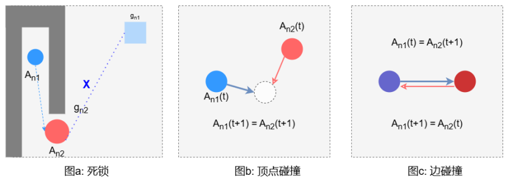

图 2多机器人路径规划约束
强化学习通过奖励机制优化机器人行为，在多机器人路径规划领域奖励设计直接影响决策效率。如表1所示，本研究系统梳理了典型奖励机制：核心要素包括移动惩罚与碰撞负奖励以约束冗余动作和冲突风险，部分方法引入基于启发式搜索的子目标正反馈机制引导全局目标递进实现，另一些则通过抑制阻塞、死锁触发及路径偏移等异常行为来提升协作效率。这些奖励方案的设计充分考虑了MRPP问题的复杂性和多机器人环境中的交互特性，为强化学习算法在该领域的应用提供了有效的引导机制。

表1 论文奖励设置列表
方法	年份	移 动	等待（未达目 标）	等待（已达目 标）	碰 撞	ego-agent 目标	all-agent subgoal 目标		阻 碍	振 荡	偏离路 线
PRIMAL	2019	↓	↓	→	↓	-	↑	-	↓	-	-
GNN	2020	-	-	-	-	-	-	-	-	-	-
MAPPER	2020	↓	↓	↓	↓	↑	-	-	-	↓	↓
G2RL	2020	↓	-	-	↓	-	-	↑	-	-	-
PRIMAL	2021	↓	↓	→	↓	↑	-	-	-	-	-
MAGAT	2021	-	-	-	-	-	-	-	-	-	-
DHC	2021	↓	↓	→	↓	↑	-	-	↓	-	-
PICO	2022	↓	↓	→	↓	-	↑	-	-	-	-
DCC	2022	↓	↓	→	↓	↑	-	-	-	-	-
SACHA	2023	↓	↓	→	↓	↑	-	-	↓	-	-
SCRIMP	2023	↓	↓	→	↓	→	-	↑	-	-	-
基于强化学习的多机器人路径规划方法因其在复杂环境中的适应性和灵活性而备受关注。然而，不同研究在评估这些方法时所采用的指标存在显著差异，这给方法的比较和性能评估带来了挑战。如表2所示详细概述了各项研究在评估其方法时所采用的指标体系。其中，规划成功率是最为常用的评估指标之一，它反映了求解器在没有任何碰撞的情况下成功解决问题的频率，直接体现了算法的可靠性和有效性。解决方案的质量通常通过路径长度（flowtime）、makespan或终身MRPP中的吞吐量等指标进行衡量，这些指标与传统的非基于学习的MRPP方法中所使用的指标具有一定的相似性，能够从不同角度反映路径规划的效率和资源利用情况。此外，一些研究关注在给定时间限制内机器人能够达到的最大目标数量，这一指标能够体现机器人在动态环境中的任务执行能力和时间管理效率。所有研究都研究评估了机器人与静态障碍物或其他机器人之间的碰撞率，这一指标对于衡量算法在复杂环境中的鲁棒性和安全性具有重要意义。
表2 论文评价指标列表
方法	年份移动	等待（未达目标）	等待（已达目标）	碰撞	ego-agent目标	all-agent目标	subgoal目标	阻碍	振荡	偏离路线
PRIMAL 2019	↓	↓	→	↓	-	↑	-	↓	-	-
GNN	2020	-	-	-	-	-	-	-	-	-
MAPPER 2020	↓	↓	↓	↓	↑	-	-	-	↓	↓
G2RL	2020	-	-	↓	-	-	↑	-	-	-
PRIMAL22021	↓	↓	→	↓	↑	-	-	-	-	-
MAGAT	2021	-	-	-	-	-	-	-	-	-
DHC	2021	↓	→	↓	↑	-	-	↓	-	-
PICO	2022	↓	→	↓	-	↑	-	-	-	-
DCC	2022	↓	→	↓	↑	-	-	-	-	-
SACHA	2023	↓	→	↓	↑	-	-	↓	-	-
SCRIMP	2023	↓	→	↓	→	-	↑	-	-	-
2.1.2 问题表述
在本研究中，本文关注的多机器人路径规划（MRPP）问题由一组机器人{1,…,n}组成，表示为一个元组⟨G,S,T⟩。其中，G=(V,E)是一个无向图，S={s1,…,sn}⊂V和T={t1,…,tn}⊂V分别表示n个机器人的起始位置和目标位置，每个机器人对应一个唯一的起始点和目标点[13]。时间被离散化为时间步，每个机器人在每个时间步可以选择移动到相邻的顶点或在其当前位置停留。只有当该动作不会导致顶点、边或交换碰撞时，移动动作才是可行的。MRPP的目标是为所有机器人找到一条无碰撞的最短联合路径，使得所有机器人从起始位置S出发，最终在某个终止时间步到达目标位置T。
在多机器人强化学习（MARL）领域，Markov游戏模型⟨N,O,A,R,P,γ⟩是一种常用的框架，用于描述机器人之间的交互过程。其中，机器人集合N={1,…,N}表示参与决策的个体；联合观测空间O=i=1NOi是由各机器人的局部观测空间Oi组成的笛卡尔积；联合动作空间A=i=1NAi同样由各机器人的动作空间Ai组成；联合奖励函数R:O×A→[−Rmax,Rmax]映射联合观测和动作到奖励值；转移概率函数P:O×A×O→ℝ描述了状态转移的概率分布；折扣因子γ∈(0,1)用于对未来奖励进行折现。
在每个时间步t∈ℕ，机器人i∈N接收到局部观测oit∈Oi，并根据其策略πi选择动作ait。策略πi是联合策略π的一部分，联合策略决定了机器人在给定观测下的行为。除了自身的观测，机器人还可以通过通信信道接收其他机器人的观测ojt和动作ajt，这为机器人提供了额外的信息用于决策。在每个时间步结束时，所有机器人共同获得奖励R(ot,at)，并观察到下一个时间步的观测ot+1，这一过程遵循转移概率P(⋅|ot,at)。机器人的目标是最大化其累积折扣奖励:
Rγ=t=0∞γtRot,at
					（3）
2.2 基于空间关系增强的多头注意力通信算法
2.2.1 多机器人路径规划问题的MDP建模
多机器人路径规划问题本质上可以被建模为马尔可夫博弈（Markov Games， MG），这是马尔可夫决策过程（Markov Decision Process，MDP）在多机器人场景下的扩展，用于描述多机器人环境中的决策过程[17]。马尔可夫决策过程（MDP）由一个五元组表示：<S,A,T,R,γ>，其中：S表示状态空间；A表示动作空间；T:S×A→P(S)是状态转移概率分布函数；R:S×A→ℝ是奖励函数；γ∈[0,1]是折扣因子。
在深度强化学习（DRL）中，策略π或值函数通常由神经网络表示。在包含N个机器人的马尔可夫博弈（MG）中，与MDP相比，需要考虑多个机器人的交互。因此，动作空间A扩展为联合动作空间A1…N=A1×…×AN，奖励函数R扩展为一组奖励函数ℛ={R1,…,RN}，其中Rn:S×An→ℝ。这种扩展需要调整状态转移概率分布函数，从而得到T:S×A1…N→P(S)，因此，MG可以用元组<A,S,A1…N,T,ℛ,γ>表示。
在大多数实际场景中，机器人无法直接观测到环境的完整状态，因此需要从观测历史或信念状态中推断出最优动作。为了解决这一问题，部分可观测马尔可夫博弈（Partially Observable Markov Games，POMG）被提出[18]。POMG通过引入观测空间O1…N=O1×…×ON，其中On表示机器人n的观测空间，进一步扩展了MG模型，其状态转移和观测分布函数表示为T:S×A1…N→P(S×O1…N)。
此外，去中心化部分可观测马尔可夫决策过程（Decentralized Partially Observable Markov Decision Process，Dec-POMDP）也被用于建模MRPP问题[19]。与POMG不同，Dec-POMDP从单个机器人的视角出发，通过引入观测其他机器人和环境的机制，简化了问题建模。Dec-POMDP可以用元组<0,S,A,T,R,ϕ,γ>表示，其中ϕ表示条件观测概率分布。这些框架为多机器人路径规划问题提供了灵活的建模方式，能够有效处理复杂的多机器人交互和部分可观测性问题。
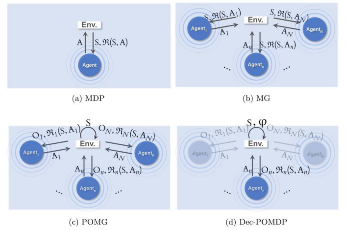
图3 多智能体强化学习建模方式
为了将MRPP问题转化为强化学习问题，本文构建了一个离散的二维网格世界环境。在这个环境中，机器人、目标和障碍物各占据一个网格单元。环境由一个m×m的矩阵表示，其中0表示空单元。在每个剧集开始时，随机分配n个不重复的起始位置和目标位置给n个机器人，并确保这些位置位于环境的同一连通区域内。与以往研究不同，本文允许机器人同时移动，并在联合动作向量上检查碰撞，这更接近于集中式规划器使用的标准MRPP设置。此外，为了模拟现实世界中的机器人应用，本文假设机器人在达到目标后仍保留在环境中，且每个机器人的视野范围（FOV）被限制为3×3的局部区域。这种部分可观察性假设不仅使得训练的策略能够扩展到任意大小的世界，还更贴近实际应用中机器人依赖有限范围传感器的场景。
状态空间S：每个机器人的观测信息由两部分组成。第一部分包含八个二进制矩阵，前四个矩阵分别对应于每个移动动作的启发式地图，当且仅当机器人执行该动作后更接近目标时，相应位置才被标记为1。其余四个矩阵分别表示附近的障碍物、其他机器人的位置、机器人自身的目标位置（如果在FOV内）以及可观察到的其他机器人目标的投影位置。第二部分是一个长度为七的向量，包含机器人与目标之间的当前归一化距离（沿x轴dx、沿y轴dy和总欧几里得距离d）、外在奖励ret−1、内在奖励rit−1、机器人前一位置与存储在短期记忆缓冲区中的位置之间的最小欧几里得距离dmint−1以及机器人在前一时间步执行的动作at−1。
动过空间Action：在多机器人路径规划环境中，动作空间被定义为机器人在每个时间步可以执行的离散动作集合。机器人可以选择向上、向下、向左或向右移动一个单元格，前提是该移动不会导致与静态障碍物或其他机器人的碰撞，机器人可以选择停留在当前位置，不进行任何移动。这些动作被形式化为一个离散的动作空间A={Up,Down,Left,Right,Stay}，其中每个动作ati∈A表示机器人i在时间步t执行的动作。动作的可行性受到以下约束：顶点碰撞：多个机器人不能同时占据同一个网格单元；多个机器人不能同时沿同一条边移动；交换碰撞：两个机器人不能在同一个时间步交换位置。
奖励R：本文的奖励结构如表所示。与以往研究一致，当前未达到目标的机器人在每个时间步都会受到惩罚，以激励其更快地完成任务。如果所有机器人在某个时间步结束时都已到达目标，或者episode达到预定义的时间限制（实践中为256个时间步），则episode终止。机器人可以相互通信，消息的发送和接收存在一个时间步的延迟，且通信不受障碍物的阻碍。
表3 奖励设置
动作	奖励
移动（上/下/左/右）	-0.3
停留（在目标上，在目标外）	0.0，0.3
碰撞	-2
阻塞	-1
2.2.2 基于空间关系增强的多头注意力通信算法RMHA
在多机器人路径规划问题中，为了设计一个高效通信的MARL范式，本文引入了通信Transformer[20-22]，它采用了图建模范式，受到序列建模发展的启发。本文应用Transformer的Encoder架构，促进输入（由机器人的观测序列(o1,…,oN)组成）和输出（由机器人的动作序列(a1,…,aN)组成）之间的映射。编码器Encoder的参数用ϕ表示，它以观测序列(o1,…,oN)作为输入，并通过几个计算块进行传递。每个这样的块由一个空间关系增强机制、一个多层感知器（MLP）[23-25]以及残差连接组成，以防止随着深度增加而出现梯度消失和网络退化。在原始的多头注意力中，元素oi和oj之间的注意力分数可以表示为它们的查询向量和键向量之间的点积：
sij=foi,oj=oiWqTWkoj
					（4）
sij可以被视为与边ej→i相关联的隐含信息，其中机器人oi查询来自机器人oj的信息。
针对大规模部分可观测环境下多机器人路径规划，在原始多头注意力[26-28]的基础上本研究创新性地提出空间关系增强型多头注意力通信机制（RMHA）。首先，构建了基于相对位置编码的空间关系表征层，将曼哈顿距离的离散值通过非线性映射转换为高维向量；其次，在注意力权重计算过程中融入空间特征张量，使得智能体在信息交互时能同步感知相邻智能体的拓扑关系；最后，设计了融合了智能体间相对距离的多通道特征融合机制，通过并行注意力头实现不同抽象层次空间特征的解耦与重组。这种空间认知与语义通信的协同优化策略，使得每个智能体在决策过程中在获取环境局部观测信息时，能通过空间感知下的注意力机制实现全局状态理解，从而在复杂动态的多机器人路径规划场景中生成具有空间一致性的协同路径规划策略。具体来说，本文将机器人之间的曼哈顿距离嵌入到一个高维向量空间作为显式的边信息和机器人观察的局部信息Observation相结合共同计算注意力分数。这种嵌入方法不仅能够捕捉机器人之间的空间关系，还能为注意力机制提供更丰富的上下文信息：
sij=goi,oj,di→j,dj→i=oi+di→jWqTWkoj+dj→i
		（5）
其中d∗→∗表示机器人之间的曼哈顿距离的嵌入向量。编码后的观测(o1,…,oN)不仅捕捉了单个机的信息，还通过通信捕捉了机器人之间的更高层次的空间关系。
在现实环境中，机器人依靠共享媒介进行信息交互时面临两大核心限制：带宽及对媒介访问的竞争。带宽限制具体表现为单位时间内可传输的数据量有限，而竞争约束则强调需防止多个机器人同时发送信息导致的信号冲突，这在无线通信中尤为关键。因此，在任意给定的时间步长内，每个机器人仅能向限定数量的其他机器人传递消息，每个机器人与有限数量的其他机器人通信的能力用边连接的邻接矩阵的稀疏度S表示。为应对这一挑战，可以通过设定机器人仅与位于特定距离范围内的其他机器人进行通信的方式来减少通信负载。设Ni(t)表示在时间t机器人i能够与其通信的所有机器人集合，则有：
Ni(t)=j∣dij(t)≤R,j≠i	
					（6）
此处，dij(t)代表时间t时机器人i与j之间的距离，R表示最大通信半径。此模型有助于理解和优化多机器人系统中的通信效率，确保数据传输的有效性和可靠性。通过这种方式，邻接矩阵S的稀疏性得以体现，其稀疏度反映了通信连接的有限性，从而在确保数据传输的有效性和可靠性的同时，优化了多机器人系统中的通信效率。因此本文还使用邻接矩阵α对注意力分数进行掩码，以确保只有来自连接机器人的信息是可访问的：
sij=sij,如 果ej→i=1,−∞,如 果ej→i=0.
.				（7）
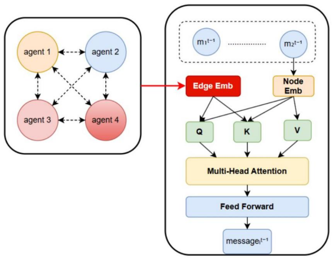
图 4 RMAH通信模型结构
2.2.3 与 MAPPO 算法的结合的 RMHA 算法
MAPPO通过引入近端策略优化技术，能够在保持策略更新稳定性的同时提升学习效率[29-31]。为了进一步增强机器人之间的协作能力，本文以MAPPO算法为基础训练框架，提出的神经网络模型中整合了上一小节所述的基于空间关系增强的多头注意通信方法RMHA，旨在促进信息的有效交流和利用。RMHA基于Transformer架构，其优势在于能够高效融合长序列信息并动态建模机器人间的交互关系，同时避免通信过载问题。相较于传统基于长短期记忆网络（LSTM）的通信方法，Transformer通过自注意力机制实现对异构信息的选择性整合，更适用于大规模多机器人场景。然而，在线强化学习的数据稀疏性与任务动态性对Transformer的训练稳定性提出了挑战。为此，本文采用以下优化措施：移除Dropout层、调整层级归一化的位置，并在残差连接中引入门控循环单元（GRU），以提升模型收敛效率。如图4所示，基于MAPPO算法的RMHA网络模型结构图由三部分组成多模态观察编码器：采用7层卷积神经网络与2层最大池化构成特征提取主干，配合3个全连接层实现特征降维。对于时刻t的机器人i，其局部观测oit∈ℝ4×m×m经过双阶段卷积处理：
oit=Conv2MPConv1oit
					（8）
σit=FC1concatσit,FC0vit
					（9）
其中vit表示7维状态向量。最终通过LSTM单元实现时序特征融合：
hit=LSTMoit,hit−1
					（10）
分布式通信模块：基于Transformer编码器，本模块将机器人间的曼哈顿距离的量化表征与注意力权重计算深度融合，有效的捕捉智能体之间的相对关系。设群体规模为n，通信模块处理如上一小节所述，可形式化为：
Q=WqMt−1+W1Distance				（11）

K=WkMt−1+W2Distance				（12）

V=WvMt−1						（13）

其中Mt−1∈ℝn×d表示上一时刻所有机器人的消息矩阵，W1Distance为机器人之间的显示边信息。注意力权重计算采用缩放点积形式：
αi=softmaxqiKTdk				（14）

信息聚合过程通过多头注意力机制实现：
headi=αiV						（15）

mit−1=concatheadi1,…,headihWo				（16）

通过限制通信范围实现局部通信，通过掩码矩阵ℳij=−∞⋅I(||pi−pj||2>r)实现空间约束，其中r为通信半径。
输出头:将LSTM隐藏状态与通信消息拼接后，生成四类输出:
1.下一时刻的消息向量；
2.外部奖励与内部奖励的状态值估计；
3.当前策略分布πiat∣ot；
4.阻塞标志预测，用于标识机器人是否阻碍其他个体路径。
本模型采用MAPPO算法为基础的训练框架，在训练过程中，外在和内在奖励的预测状态值都通过最小化预测值与折扣回报之间的时序差（TD）误差进行更新。输出策略使用以下损失函数进行优化：
Lπ(θ)=Etminrt(θ)At,cliprt(θ),1±ϵAt		（17）

其中优势函数At采用GAE估计，重要性采样比率rt(θ)=πθ(at|ot)πθold(at|ot)。
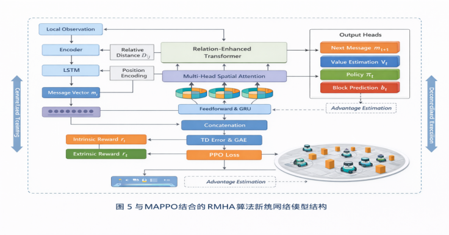
图 5与MAPPO结合的RMHA算法神经网络模型结构
MAPPO算法采用集中式训练分散式执行（CTDE），智能体训练阶段通过共享环境状态、动作及奖励信息，构建全局视角的联合策略模型，有效解决多智能体协作中的信用分配与非平稳性问题；执行阶段各智能体仅依赖局部观测独立决策，兼顾系统可扩展性与实时性。可以做到既利用全局信息提升策略协同性，又避免执行时通信开销过大的缺陷。基于以上描述，本文在训练方式上采用集中训练和分散执行的方法对于每个机器人i，首先，初始化观测编码器参数ϕ，基于Transformer的通信块参数ψ，输出头参数θ，以及回放缓冲区B（算法第2行）。在每一个回合k中，通过环境交互得到初始观测o01,…,o0N（算法第3行），之后开始持续T个步数的数据收集任务（算法第4-43行）。对于每个机器人i，在时隙t内，首先使用编码器ϕ将局部观测oti编码为特征向量，并与位置编码部分连接，通过全连接层和LSTM单元处理（算法第7-11行）。每个机器人生成消息mti，并计算与其他机器人的距离Dti（算法第14行）。通过添加正弦位置嵌入的机器人ID，利用L层Transformer进行通信，包括基于距离的多头自注意力计算、GRU更新和前馈网络处理（算法第17-20行）。随后，将Transformer输出与LSTM状态连接，生成策略πti、价值估计vti和阻塞预测bti（算法第23-25行）。对于每对冲突机器人，基于状态价值差异计算优先级概率，采样高优先级机器人动作，其余机器人重采样动作（算法第27-32行）。每个机器人通过episodebuffer计算当前位置与历史记录的最大距离，若超过阈值τ则生成内在奖励riti并更新缓冲区（算法第34-40行）。执行联合动作at1,…,atN并收集奖励，将经验(ot,at,rt)存入回放缓冲区B（算法第41-42行）。回合结束后，从B中随机采样数据，使用GAE计算优势，通过PPO损失函数更新所有网络参数（算法第45-47行）。
表4 RMHA 算法训练流程
RMHA算法伪代码
1:输入:机器人数量N，回合数K，每回合步数T，视野大小F，Transformer层数L，折扣因子γ，PPO剪切参数ε，内在奖励参数τ、φ、β、M。
2:初始化:观测编码器参数φ，基于Transformer的通信块参数ψ，输出头参数θ，回放缓冲区B。
3:for k=0，1，…，K-1 do
4:for t=0，1，…，T-1 do
5:从环境中收集观测值ot1，…，otN。
6://编码观测值
7:for 每个机器人 i do
8:使用φ将局部观测ot编码为ot。
9:编码向量部分ot并与ot连接。
10:通过全连接层和LSTM单元。
11:end for
12://基于Transformer的通信
13:for 每个机器人 i do
14:生成消息mt。计算与其他机器人之间的距离Dt
15:end for
16:使用正弦位置嵌入为消息添加机器人ID。
17: for l=1,2,…,L do
18: 根据生成的消息 mti 和距离 Dti ，计算消息的多头自注意力。
19: 使用 GRU 和前馈网络更新消息。
20: end for
21: // 输出头
22: for 每个机器人 i do
23: 将Transformer输出与LSTM输出连接。
24: 生成策略 πti 、价值估计 vti 和阻塞预测 bti 。
25: end for
26: //基于价值的冲突解决
27: for 每对冲突机器人 (i,j) do
28: 计算状态价值差异 diffti 和 difftj 。
29: 使用softmax计算优先级概率。
30: 根据优先级概率采样移动的机器人。
31： 其他机器人重采样动作。
32: end for
33: // 用于探索的 episode buffer
34: for 每个机器人 i do
35: 计算与缓冲区中存储位置的最大距离。
36: if 最大距离 ≥τ then
37: 生成内在奖励 riti 。
38: 如果容量允许，将当前位置添加到缓冲区。
39: end if
40: end for
41：执行联合动作 at1,…,atN 并收集奖励 rt1,…,rtN
42: 将 (ot,at,rt) 插入到 B 中。
43: end for
44: // 使用PPO进行训练
45: 从 B 中采样随机小批量。
46：使用GAE计算优势。
47: 使用PPO损失函数更新 ϕ 、 ψ 、 θ 。
48: end for
3 实验设置与结果分析
3.1 实验环境与参数设置
在本研究中，本文采用了一种综合性的实验设计，旨在评估所提出的多机器人路径规划方法——RMHA在不同场景下的性能表现。
实验环境基于之前章节中描述的MRPP设置，训练阶段中，机器人的数量统一设置为8个，视野范围（FOV）大小为3×3，网格世界的尺寸随机选取为10×10、25×25或40×40，障碍物的密度则遵循0%至50%的三角分布，峰值设定在33%。在测试阶段，机器人的数量分别设置为128，网格世界的尺寸和障碍物密度也相应地进行了调整，障碍物密度与分布形态显著影响成功率。这种训练阶段和测试阶段机器人数量的差异设置旨在评估算法在不同规模下的性能和泛化能力。
图6为一个典型的多机器人路径规划世界网格图，具有10×10个单元，障碍物密度为30%，用于包括8个机器人的测试运行。彩色方块表示机器人的初始位置，彩色圆圈表示机器人的目标位置。灰色圆圈表示障碍物，红色虚线矩阵为机器人的视野范围，大小为3×3。
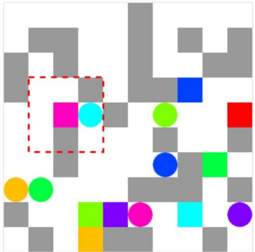
图 6多机器人路径规划环境(10×10)
为进一步验证所提出方法在不同规模多机器人场景下的泛化能力，本文设计了机器人数量逐级扩展的对比实验。在训练阶段，模型仅在 8 个机器人规模下进行训练；在测试阶段，将机器人数量分别扩展至 16、32、64 和 128，以评估算法在规模变化条件下的性能稳定性。图 7 给出了不同机器人数量条件下 RMHA 在 MRPP 任务中的成功率对比结果。可以观察到，随着机器人数量的增加，任务难度显著提升，整体成功率呈现一定下降趋势。然而，RMHA 在 16 至 64 个机器人规模下仍保持较高的成功率，在 128 个机器人的大规模场景中也未出现性能崩塌，表明所提出方法具备良好的规模泛化能力。
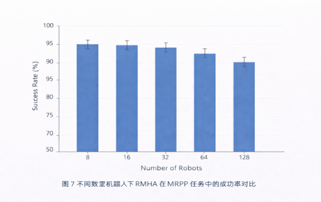
图 7 不同机器人数量下 RMHA 在 MRPP 任务中的成功率对比
该结果表明，基于空间关系增强的通信机制能够有效缓解多机器人数量扩展带来的协作复杂性问题，使模型在未见规模条件下仍能保持稳定的路径规划性能。
实验的训练和测试部分是在一台配备双NVIDIARTX8000显卡的Ubuntu服务器上完成的，使用的软件环境为Pytorch2.1和Python3.7，具体的参数设置如下表。
表 5 实验参数设置
参数	参数设置
训练使用的机器人数量	8
动作数量	5
训练中的最大回合长度	256
视野范围大小	3
世界尺寸	(10，40)
障碍物概率	(0.0，0.5)
掩码距离	40
动作成本	-0.3
空闲成本	-0.3
目标奖励	0.0
碰撞成本	-2
阻塞成本	-1
3.2 对比基线与评价指标
在性能评估方面，本文选择了三种当前最先进的多机器人强化学习（MARL）方法作为对比基准：基于图神经网络的可扩展通信的SCRIMP方法，基于图神经网络的通信方法DHC[31]和基于临时路由通信方法PICO。所有对比方法的训练超参数均按照其官方代码或论文中的设置进行配置，其中SCRIMP的视野范围为3×3，DHC的视野范围（FOV）为9×9，PICO为11×11。此外，本文还将具有膨胀因子ϵ=2.0和5分钟超时的经典集中式规划器ODrM*的结果作为参考。
评估指标涵盖了达到目标的最大数量（MR）、与障碍物（包括机器人间的碰撞）的碰撞率（CO）以及成功率（SR），具体含义如下：
最大目标达成数（MR）：是指在实验过程中某一时刻所有机器人中到达目标位置的最大数量
碰撞率：与静态障碍物（包括边界）及其它机器人的碰撞比率（CO）计算公式为：碰撞次数/（实验时长×机器人数量×100%）。
成功率（SR）：是指在规划时间/实验时长限制内所有机器人都达到目标的实验所占的百分比。成功率定义为在最大允许时间Tmax内，所有机器人无碰撞到达目标位置的实验占比：
Sr=NsuccessNtotal×100%					（18）

其中Nsuccess为成功案例数，Ntotal为总实验次数。该指标通过蒙特卡洛方法进行统计验证，通常要求Ntotal≥100以保证统计显著性。
3.3 实验结果与分析
3.3.1通信消融实验
为了公平比较基于Transformer的通信机制的重要性，本文开发了两种消融基线：MAPPO和MAPPO+图通信。这些RMHA变体的结构与原始RMHA相同，不同之处在于对于MAPPO，完全移除了整个通信机制，即机器人从未接收或使用消息。对于MAPPO+图通信，在通信时仅仅根据消息内容进行注意力权重的计算，在计算消息注意力时未融合曼哈顿距离的嵌入。所有实验机器人数量均为128，均在一个40×40大小的网格环境中进行，并分别设置了障碍物密度为0%、15%和30%的三种情况。
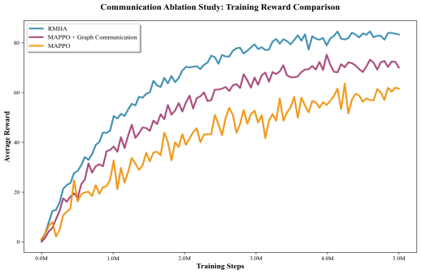
图 8通信消融实验：奖励对比
图8展示了三种方法RMHA、MAPPO+图通信和MAPP在训练过程中的奖励变化趋势，横坐标为训练步数，纵坐标为所有机器人或得的奖励制，从图中可以看出，三种方法的奖励值在训练初期都迅速上升，表明机器人在学习过程中逐渐掌握了路径规划的基本策略。然而，RMHA和MAPPO+图通信的奖励值在达到一定阶段后趋于稳定，而MAPPO的奖励值上升较慢，且波动较大。这表明图通信和RMHA在训练效率和收敛性方面具有显著优势。
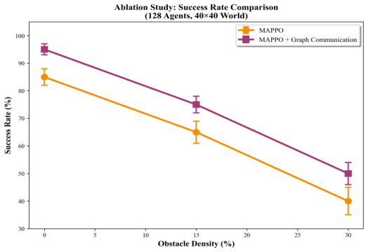
图 9通信消融实验：成功率对比图
如图9所示，横坐标为环境中障碍物密度，纵坐标为所有机器人到达目标的成功率，图中包含两条曲线：蓝色曲线代表MAPPO的成功率，橙色曲线代表MAPPO+图通信的成功率，从图中可以看出，随着障碍物密度的增加，两种方法的成功率均有所下降，但MAPPO+图通信的成功率始终高MAPPO，尤其是在障碍物密度较高的情况下（30%），MAPPO的成功率接近40%，而MAPPO+图通信的成功率仍保持在50%左右，这表明图通信在复杂环境中显著提升了多机器人路径规划的成功率。这是因为在高密度障碍物环境中，机器人的局部视野受限，容易导致路径冲突和死锁，图通信通过多头自注意力机制动态融合全局信息，使机器人能够感知到其他机器人的意图和位置，从而减少冲突并提高协作效率。
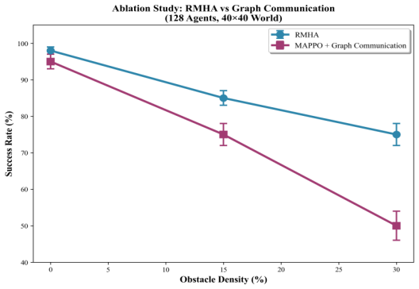
图 10通信消融实验：成功率对比图
如图10所示，图中包含两条曲线：横坐标为环境中障碍物密度，纵坐标为所有机器人到达目标的成功率，绿色曲线代表RMAH的成功率，橙色曲线代表MAPPO+图通信的成功率，从图中可以看出，随着障碍物密度的增加，两种方法的成功率均有所下降，但RMAH的成功率始终高MAPPO+图通信，尤其是在障碍物密度较高的情况下（30%），RMAH的成功率为75%，而MAPPO+图通信的成功率仍保持在50%左右，这表明基于机器人间曼哈顿距离的关系编码的多头注意力通信方法RMAH能更准确地理解自身与环境以及其他机器人之间的关系，有助于机器人在复杂的、动态变化的环境中做出最优决策，从而提高整体路径规划的效率和准确性。尤其是在高障碍物密度的情况下，RMHA能够有效避免碰撞并找到可行路径，从而维持较高的成功率。
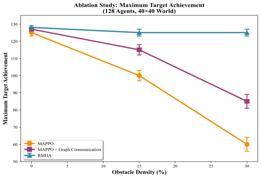
图 11通信消融实验：最大目标达成数对比图
如图11所示，横坐标为环境中障碍物密度，纵坐标为所有机器人的最大目标达成数，该图展示了三种方法MAPPO、MAPPO+图通信和RMHA在不同障碍物密度下的最大目标达成数变化趋势。MAPPO算法随着障碍物密度的增加，最大目标达成数迅速下降，表明其在复杂环境中达成目标的能力下降较快，RMHA算法的最大目标达成数下降最慢，尤其是在高密度环境下，仍然能保持在接近125个的最大目标达成数，这表明机器人间距离信息对于多机器人路径规划的决策优化非常重要。这些结果验证了在更依赖机器人合作的复杂任务中，通过基于机器人间距离的关系增强可以有效地动态融合其他机器人的信息，从而提高路径规划的效率和鲁棒性。
在以上实验结果的基础上，讨论多机器人路径规划中机器人间通信机制的泛化能力。进一步分析RMHA算法的通信机制在不同机器人数量下的表现，可以发现其基于空间关系增强的多头注意力通信方法在不同规模的机器人环境中均能有效提高通信效率和协作能力。在训练阶段，8个机器人之间的通信权重分配和信息融合效果良好，机器人能够通过局部通信协调彼此的行动，避免路径冲突和死锁。在测试阶段，扩展到128个机器人后，算法通过动态调整通信权重，仍然能够有效过滤低价值信息，强化邻近机器人的协同响应。实验结果表明，在128个机器人、障碍物密度为30%的环境中，所有机器人均到达目标位置的成功率比无关系增强的通信算法提高了53%，验证了RMHA算法在大规模机器人环境中的泛化能力和鲁棒性。
3.3.2与当前研究的算法对比
为验证本文提出的基于空间关系增强的多头注意力通信方法 RMHA 的有效性，本文将其与现有代表性多机器人路径规划算法（ODRM*、SCRIMP、DHC、PICO 等）在更贴近真实应用的基准地图上进行对比评估。考虑到完全随机生成地图在结构特征、可复现实验和统计置信度方面存在不足，本节采用两类典型场景地图：Warehouse（仓储）地图与City/Game（城市/游戏）地图。其中，Warehouse 地图具有规则货架通道与狭窄走廊等结构特征，能够模拟仓储拣选与搬运场景；City/Game 地图包含更复杂的街区/迷宫式障碍布局，能够模拟城市交通网或游戏关卡等非规则环境，从而更全面评估算法在不同结构先验下的泛化能力与鲁棒性。
实验设置如下：所有实验均在 40×40 网格环境中进行，机器人数量固定为 128。针对每一类地图，在每个障碍复杂度设置下（与前述实验一致，这里仍采用 0%、15%、30% 三档便于横向对齐），分别采样生成 100 张可复现地图实例（固定随机种子/实例编号），并对每种算法在同一组实例上独立运行，确保对比的公平性与统计可靠性。为降低偶然性影响，本文对成功率等指标报告均值，并在图中给出置信区间（或标准误），必要时采用配对显著性检验对算法差异进行验证。
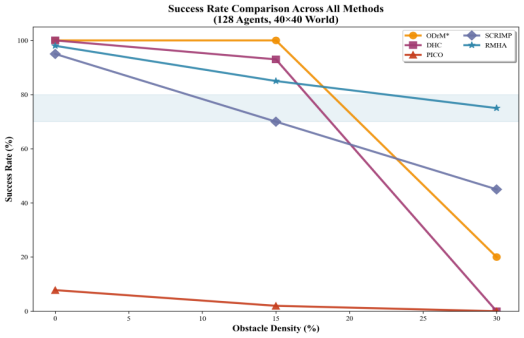
图 12 各算法的成功率对比
实验结果如图 12 所示，横坐标为障碍复杂度（0%、15%、30%），纵坐标为所有机器人在时限内无碰撞到达目标的成功率。总体来看，随着障碍复杂度升高，各算法成功率均呈下降趋势，但 RMHA 在两类地图的各复杂度设置下均保持领先，且优势在高复杂度场景更为显著。
在低复杂度（0%）条件下，RMHA 与 ODRM*、SCRIMP 等方法表现接近，说明在开阔环境中多方法均可较好完成任务；随着复杂度上升至 15% 与 30%，RMHA 的优势逐步扩大，尤其在 30% 高复杂度下，RMHA 仍保持较高成功率（约 75%），而 SCRIMP 下降至 50% 以下；ODRM* 在给定规划时限（如 5 min）内的成功率进一步降低（约 20%），DHC 与 PICO 在高复杂度下出现明显性能退化甚至无法完成任务。该结果说明 RMHA 在复杂拥挤环境下具备更强的协作鲁棒性，更适用于对路径规划稳定性要求较高的真实场景（如仓储通道与城市/关卡类复杂布局）。
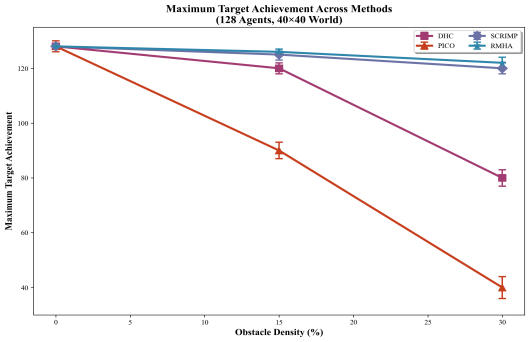
图 13 各算法的最大目标达成数对比
图 13 给出了不同算法在两类地图、不同复杂度下的最大目标达成数（即在时限内成功到达目标的机器人数量上限）对比。可以观察到，PICO 与 DHC 的最大目标达成数随复杂度升高下降最快。尽管两者引入了通信机制，但由于通信建模缺少对机器人间动态关系结构的有效表达，难以在高拥堵/强约束通道中形成稳定的冲突消解策略，导致在高复杂度环境中协作效率显著下降。
相比之下，采用图注意力/Transformer 类通信建模的 SCRIMP 与 RMHA 的最大目标达成数整体更稳定：在 30% 高复杂度下仍可保持 120+ 的目标达成数。其原因在于该类方法能够更有效地整合来自其他机器人的信息，提升冲突预判与协同避让能力。进一步地，RMHA 在此基础上引入空间关系编码，将机器人间相对位置信息融合进多头注意力权重计算，从而更精确地刻画交互强度与局部拥堵结构，提升路径规划决策的可解释性与鲁棒性。综合两项指标可见，在结构化仓储地图与非规则城市/关卡地图中，RMHA 均表现出更高的成功率与更稳定的目标达成能力，验证了空间关系增强通信在复杂多机器人路径规划任务中的有效性。
3.3.3多机器人路径规划轨迹示例
为直观展示不同算法在多机器人路径规划任务中的整体行为差异，本文首先给出 RMHA 与 MAPPO 在同一测试环境下的全局轨迹对比结果。如图 14 所示，在复杂障碍分布条件下，RMHA 生成的整体轨迹更加有序，机器人之间的路径冲突较少，大多数机器人能够顺利到达目标位置；相比之下，MAPPO 的轨迹在局部区域内呈现出明显的交叉与堆叠现象，部分机器人在规划过程中出现长时间停滞，最终未能完成任务。该全局轨迹结果从整体层面验证了 RMHA 在多机器人协作路径规划中的有效性。
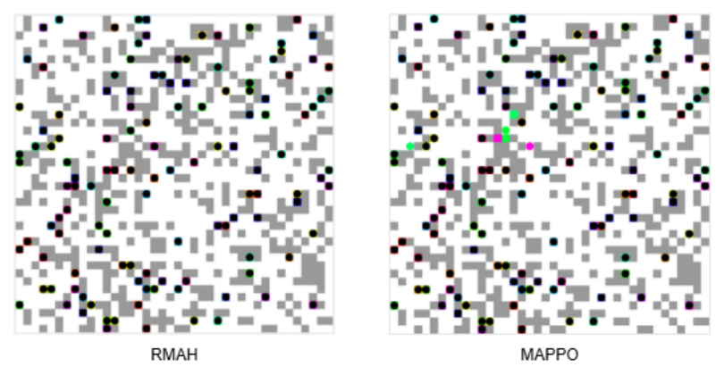
图 14多机器人路径规划轨迹
仅通过全局轨迹仍难以清晰揭示算法在关键冲突位置的决策机理。为进一步分析多机器人在交互细节层面的行为差异，本文在全局测试地图中选取一个具有代表性的狭窄通道（corridor）局部区域，构造典型的面对面会车冲突场景，并给出连续时刻下的局部轨迹对比，如图 15 所示。
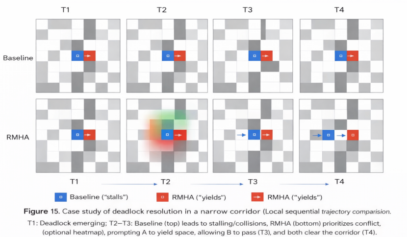
图 15 狭窄通道场景下的死锁消解案例
在该局部场景中，截取一个 10×10 的区域，其中机器人 A（蓝色）与机器人 B（红色）分别从通道两端相向行进。在时刻 T1，两机器人进入狭窄通道并形成直接冲突态势；在 Baseline 方法中，由于仅依赖局部观测且缺乏显式协作通信机制，双方在 T2–T3 阶段采取相似的前进或等待策略，导致僵持或碰撞反复出现，通道占用无法有效释放，最终演化为局部死锁。
相比之下，RMHA 在相同场景下展现出不同的协同行为模式。在 T2 时刻，基于空间关系增强的多头注意力通信机制，机器人能够显式感知冲突邻居的接近程度，并在决策过程中提高对该冲突关系的关注权重；在 T3 时刻，机器人 A 主动采取后退或侧移一步的避让动作（yield），为机器人 B 释放通道占用权，使其顺利通过；在 T4 时刻，两机器人均完成通行并继续向各自目标前进。
图 14 从全局层面展示了 RMHA 在复杂环境中的整体协作优势，而图 15 则从微观连续决策角度揭示了 RMHA 通过空间关系编码与注意力通信机制实现冲突预判与有序让行的内在原因。该结果表明，RMHA 不仅能够提升多机器人路径规划的整体成功率，还能在狭窄通道等高冲突结构中有效降低死锁发生概率。
4结论
本文围绕多机器人路径规划中的协同通信问题，从通信机制建模、算法框架融合以及实验验证三个层面开展研究，提出了空间关系增强的多头注意力通信方法，并在复杂环境下验证了其有效性和适用性。提出了一种基于图注意力机制的高效通信方法RMHA，用于解决多机器人路径规划中的通信效率和协作优化问题。通过引入空间关系增强的多头注意力通信方法，RMHA结合机器人间的相对距离信息和通信内容，动态调整通信权重，显著降低了通信负载并提升了路径规划的成功率。实验结果表明，RMHA在不同障碍物密度环境下均表现出较高的适应性和鲁棒性，特别是在高密度环境中，其成功率显著优于现有方法。此外，通信机制的消融实验进一步验证了机器人间距离信息在优化路径规划决策中的重要性。综上所述，RMHA为复杂多机器人环境中的高效协作提供了一种有效的解决方案。
参考文献
[1] Wang Y, Ang B, Huang S, et al. SCRIMP: Scalable communication for reinforcement- and imitation-learning-based multi-agent pathfinding[C]// 2023 IEEE/RSJ International Conference on Intelligent Robots and Systems (IROS). IEEE, 2023: 9301–9308.
[2] Li J, Tinka A, Kiesel S, et al. Lifelong multi-agent path finding in large-scale warehouses[C]// Proceedings of the AAAI Conference on Artificial Intelligence. 2021, 35(13): 11272–11281.
[3] Zhang Y, Fontaine M C, Bhatt V, et al. Multi-robot coordination and layout design for automated warehousing[J]. arXiv preprint arXiv:2305.06436, 2023.
[4] Dresner K, Stone P. A multiagent approach to autonomous intersection management[J]. Journal of Artificial Intelligence Research, 2008, 31: 591–656.
[5] Ma H. Graph-based multi-robot path finding and planning[J]. Current Robotics Reports, 2022, 3(3): 77–84.
[6] Tamura H ,Konno T ,Ito K , et al.Human Behavior and Comfort During Load Carrying to Autonomous Mobile Robot[J].International Journal of Social Robotics,2025,(prepublish):1-19.DOI:10.1007/S12369-025-01329-Z.
[7] SILVER D. Cooperative pathfinding[C]// Proceedings of the AAAI Conference on Artificial Intelligence and Interactive Digital Entertainment, Vol.1, Pittsburgh, USA, 2005: 117–122.
[8] Sharon G, Stern R, Felner A, Sturtevant N R. Conflict-based search for optimal multi-agent pathfinding[J]. Artificial Intelligence, 2015, 219: 40–66.
[9] Ren Z, Rathinam S, Choset H. Subdimensional expansion for multi-objective multi-agent path finding[J]. IEEE Robotics and Automation Letters, 2021, 6(4): 7153–7160.
[10] Ellis J. Multi-agent path finding with reinforcement learning[D]. Stellenbosch: Stellenbosch University, 2021.
[11] Huang L, Zhu Q. The strategic value of observable cost in stochastic games[J]. IEEE Transactions on Cybernetics, 2021, 52(10): 10506–10519.
[12] Sartoretti G, Kerr J, Shi Y, Wagner G, Kumar T K S, Koenig S, Choset H. Multi-agent path finding with prioritized communication learning: Pathfinding via reinforcement and imitation multiagent learning[J]. IEEE Robotics and Automation Letters, 2019, 4(3): 2378–2385.
[13] Chung J, Fayyad J, Younes Y A, et al. Learning team-based navigation: A review of deep reinforcement learning techniques for multi-agent pathfinding[J]. Artificial Intelligence Review, 2024, 57(2): 41.
[14] Wang Y, et al. LNS2+RL: Combining multi-agent reinforcement learning with large neighborhood search in multi-agent path finding[C]// Proceedings of the AAAI Conference on Artificial Intelligence. 2025, 39(22).
[15] Li Q, Gama F, Ribeiro A, Prorok A. Graph neural networks for decentralized multi-robot path planning[C]// Proceedings of the IEEE/RSJ International Conference on Intelligent Robots and Systems (IROS). 2020: 11785–11792.
[16] Li Q, Lin W, Liu Z, Prorok A. Message-aware graph attention networks for large-scale multi-robot path planning[J]. IEEE Robotics and Automation Letters, 2021, 6(3): 5533–5540.
[17] Huang L, Zhu Q. The strategic value of observable cost in stochastic games[J]. IEEE Transactions on Cybernetics, 2021, 52(10): 10506-10519.
[18] Ma Z, Luo Y, Ma H. Distributed heuristic multi-agent path finding with communication[C]// 2021 IEEE International Conference on Robotics and Automation (ICRA). IEEE, 2021: 8699–8705.
[19] Guan H, Gao Y, Zhao M, Yang Y, Deng F, Lam T L. Ab-mapper: Attention and BicNet based multi-agent path planning for dynamic environment[C]// 2022 IEEE/RSJ International Conference on Intelligent Robots and Systems (IROS). IEEE, 2022: 13799–13806.
[20] Wang P ,Ghergherehchi M ,Kim J , et al. Transformer-based path planning for single-arm and dual-arm robots in dynamic environments[J].The International Journal of Advanced Manufacturing Technology,2025,139(7-8):1-19.
[21] Xiong Z ,Wang Y ,Tian Y , et al. RoPT: Route-Planning Model with Transformer[J].Applied Sciences,2025,15(9):4914-4914.
[22] Lee K ,Im E ,Cho K . Mission-Conditioned Path Planning with Transformer Variational Autoencoder[J].Electronics,2024,13(13):2437-2437.
[23] Aina S T ,Iyaomolere A B . Multi Hand Gesture Recognition Using a Multilayer Perceptron (MLP) Model with mmWave Radar Sensing Data[J].Journal of Engineering Research and Reports,2025,27(11):194-203.
[24] Wang X ,Xu F ,Zhang M . A transfer learning-enhanced multilayer perceptron for buffeting response prediction of long-span bridges[J].Journal of Wind Engineering &amp; Industrial Aerodynamics,2025,267106258-106258.
[25] Ouaret A ,Talantikite I S ,Lehouche H , et al. A direct adaptive control architecture for buildings thermal comfort and energy efficiency optimization using multilayer perceptron neural networks and model reference learning[J].Energy &amp; Buildings,2025,349116528-116528.
[26] Xiao H ,Fu L ,Shang C , et al. Collaborative energy-saving path planning of unmanned surface vehicle cluster based on multi-head attention mechanism and multi-agent deep reinforcement learning[J].Engineering Applications of Artificial Intelligence,2025,161(PB):112078-112078.
[27] Chen Z ,Liu Y ,Ni W , et al. Predicting driving comfort in autonomous vehicles using road information and multi-head attention models[J].Nature Communications,2025,16(1):2709-2709.
[28] Shuyu C ,Yingan L . Research on Transportation Mode Recognition Based on Multi-Head Attention Temporal Convolutional Network.[J].Sensors (Basel, Switzerland),2023,23(7):DOI:10.3390/S23073585.
[29] Zhou Y ,Yue Y ,Yan B , et al. Collaborative Target Tracking Algorithm for Multi-Agent Based on MAPPO and BCTD[J].Drones,2025,9(8):521-521.
[30] Zhang P ,Li G . A cooperative dynamic target search approach for multi-UAV systems utilizing the MAPPO algorithm[J].Discover Artificial Intelligence,2025,5(1):153-153.
[31] Ding Z ,Wang X ,Cai C , et al. Multi-UAV intelligent decision-making method with layer delay dual-center MAPPO for air combat[J].Applied Intelligence,2025,55(11):811-811.